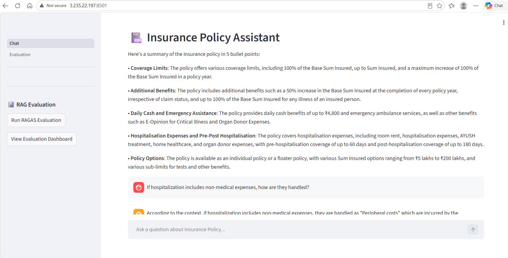
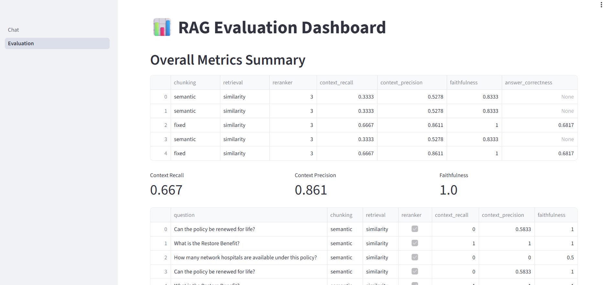
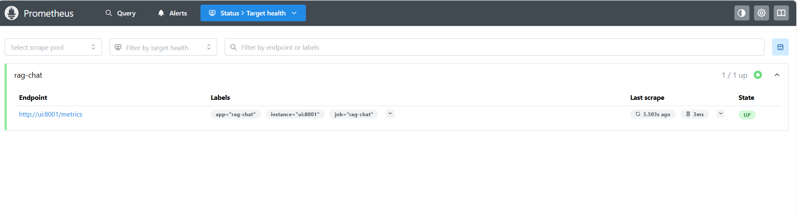
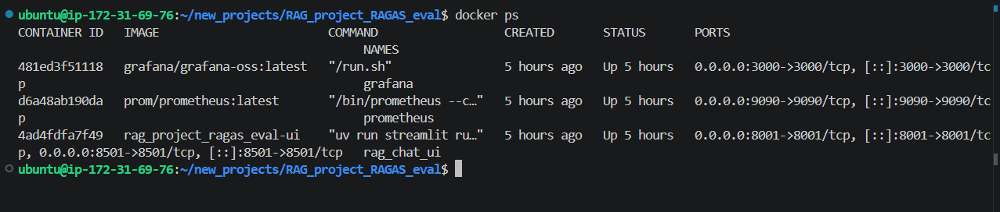
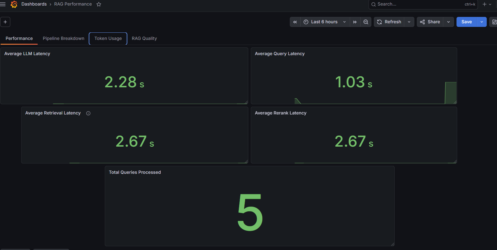
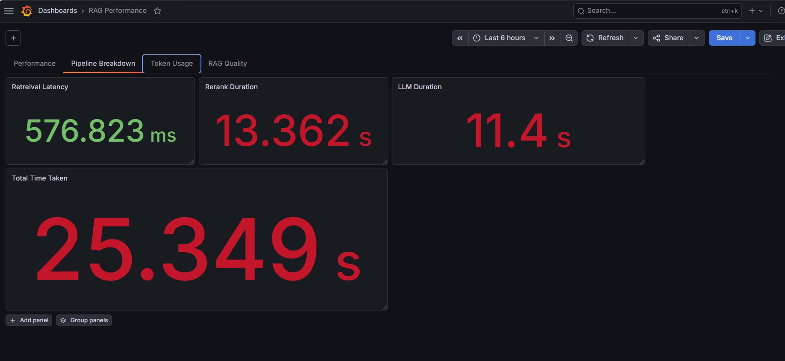
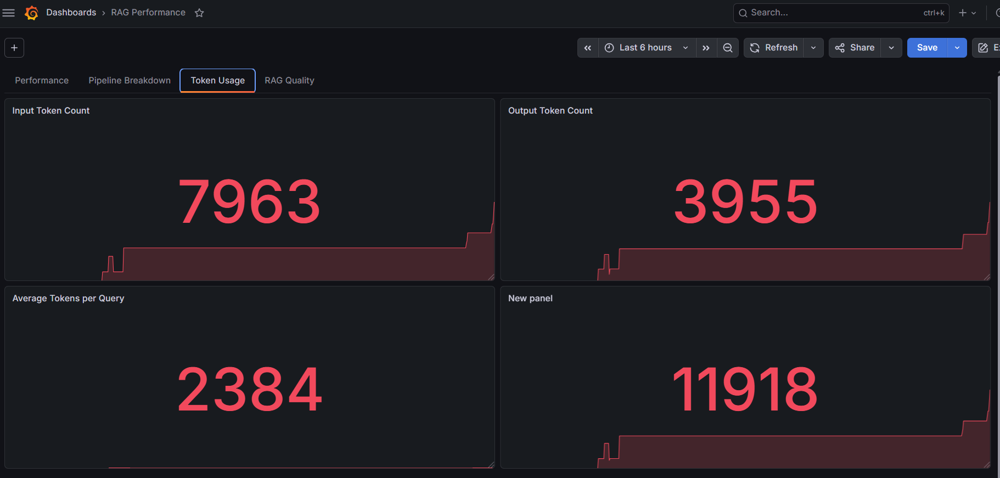
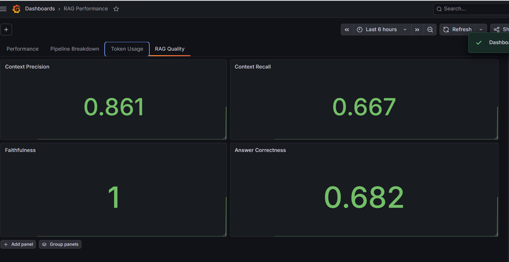

# 🏥 Insurance Policy RAG Assistant with RAGAS Evaluation & Observability.


## 📖 Problem Statement

Insurance policy documents are designed to be legally comprehensive rather than easy to read. Important details such as coverage limits, exclusions, waiting periods, and claim conditions are often spread across multiple sections and described using formal legal terminology. As a result, users frequently struggle to quickly locate and understand the information they need before making a purchasing decision.

This project was inspired by my own experience while comparing health insurance plans. Although I could understand individual sections while reading the document, I often found myself revisiting the same pages to clarify questions that arose later. The lack of an interactive way to query policy documents made the decision-making process both time-consuming and confusing.

To address this problem, I developed an AI-powered Insurance Policy Assistant using Retrieval-Augmented Generation (RAG). The assistant enables users to ask natural language questions about policy documents and receive accurate, context-grounded responses. In addition, the project evaluates retrieval quality using RAGAS and provides production-style observability through Prometheus and Grafana to monitor system performance and RAG pipeline metrics.

## ✅ Goal: 

Simplify the process of understanding insurance policy documents by enabling users to interact with them conversationally instead of manually searching through lengthy legal text.

## Features
- Multiple Chunking Strategies
- Similarity Retrieval
- MMR Retrieval
- Hybrid Retrieval
- Optional Reranking
- Gemini & Groq LLM Support
- RAGAS Evaluation
- Token Analytics
- Prometheus Metrics
- Grafana Dashboards
- Dockerized Deployment
- AWS EC2 Deployment


## Architecture

```text
    PDF
     │
     ▼
Chunking Strategy
     │
     ▼
Vector Database
     │
     ▼
Retrieval Strategy
     │
     ▼
Optional Reranker
     │
     ▼
    LLM
     │
     ▼
Streamlit UI
     │
     ▼
Amazon EC2
```

## Monitoring

```text
     User

      │

Streamlit UI(Port 8501)

      │

Metrics (:8001)

      │

Prometheus (Port 9090)

      │

Grafana (Port 3000)
```

## Tech Stack
| Component        | Technology             |
| ---------------- | ---------------------- |
| Framework        | LangChain              |
| Frontend         | Streamlit              |
| Vector DB        | FAISS                  |
| Embeddings       | HuggingFace            |
| LLM              | Gemini/Groq            |
| Evaluation       | RAGAS                  |
| Monitoring       | Prometheus             |
| Dashboard        | Grafana                |
| Containerization | Docker                 |
| Cloud Deployment | AWS EC2                |

## Steps to run locally
uv sync

uv run streamlit run ui/1_Chat.py

## Docker Deployment
docker compose build

docker compose up -d

## AWS Deployment
- Docker Images
- EC2
- Docker Compose

## Project Highlights
- Built an end-to-end RAG application

- Compared multiple chunking strategies

- Compared multiple retrieval strategies

- Integrated reranking

- Automated RAG evaluation using RAGAS

- Instrumented Prometheus metrics

- Designed Grafana dashboards

- Containerized using Docker Compose

- Deployed on AWS EC2

## Screenshots
### Home Page



### RAG Evaluation Summary Page



### Prometheus Targets


### Docker Containers



## 📈 Monitoring (Grafana Dashboards)

The application is instrumented using **Prometheus** and visualized through **Grafana** to monitor RAG pipeline performance, token usage, and answer quality in real time.

### 🚀 RAG Performance Metrics

- **Query Rate** – Number of user queries processed.
- **Average Query Latency** – End-to-end response time for each RAG request.
- **Average Retrieval Latency** – Time spent retrieving relevant documents from the vector store.
- **Average Rerank Latency** – Time taken by the reranker to reorder retrieved documents.
- **Average LLM Latency** – Time taken by the Large Language Model to generate the final response.

---

### 🔤 Token Analytics

- **Input Token Count** – Total tokens sent to the LLM (user query + retrieved context).
- **Output Token Count** – Tokens generated by the LLM in the response.
- **Average Tokens per Query** – Average token consumption for each user request.

These metrics help analyze inference cost, prompt size, and overall LLM utilization.

---

### 📊 Pipeline Monitoring

The dashboard provides visibility into the execution time of each stage of the RAG pipeline, helping identify bottlenecks and optimize performance.

- Retrieval
- Reranking
- LLM Response Generation
- Overall Query Processing

---

### 📷 Dashboard Preview

### RAG Performance Dashboard


### Pipeline Metrics Dashboard


### Token Analytics Dashboard



## 🎯 RAG Evaluation (RAGAS)

The retrieval pipeline is evaluated using **RAGAS (Retrieval-Augmented Generation Assessment)** to measure the quality of retrieved context and generated responses.

### Evaluation Metrics

| Metric | Description |
|---------|-------------|
| **Context Precision** | Measures how relevant the retrieved context is to the user query. Higher values indicate fewer irrelevant chunks. |
| **Context Recall** | Measures how well the retrieved context covers the information required to answer the question. |
| **Faithfulness** | Measures whether the generated answer is grounded in the retrieved context rather than hallucinated. |
| **Answer Correctness** | Measures how closely the generated answer matches the expected ground truth. |

### Evaluation Workflow

1. Generate answers for a predefined evaluation dataset.
2. Retrieve supporting document chunks.
3. Compare generated answers with ground truth.
4. Compute RAGAS metrics.
5. Store:
   - Experiment-level metrics
   - Question-wise metrics
6. Display results in the Evaluation Dashboard.

### Evaluation Dashboard

The application includes a dedicated **Evaluation** page that displays:

- Overall experiment metrics
- Question-wise evaluation scores
- Retrieved context
- Ground truth answers
- Generated answers

This enables comparison of different chunking, retrieval, and reranking strategies to identify the best-performing RAG configuration.

### RAG Evaluation Metrics Dashboard


